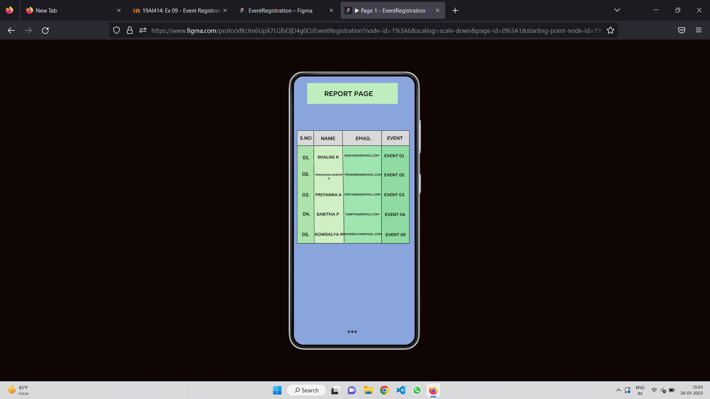

# Event Registration Web Application

## AIM:
To design, develop and deploy a web application for event registration.

## DESIGN STEPS:

### Step 1:

Go to the figma.com website.

### Step 2:

Login and create a team project.

### Step 3:

Each team member can take part in designing the pages.

### Step 4:

Create a login page,home page,report page,registration page and thankyou page.

### Step 5:

Prototype the pages.

### Step 6:

Validate the HTML and CSS code.

### Step 7:

Publish the website in the given URL.

## DESIGN:

## Result:

Thus,successfully designed a web page for event registration and displayed.
